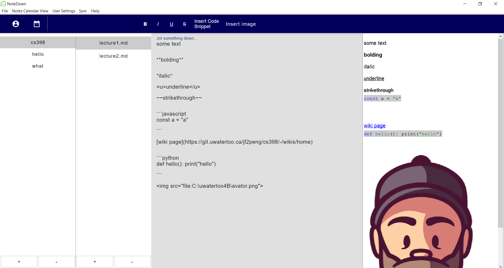
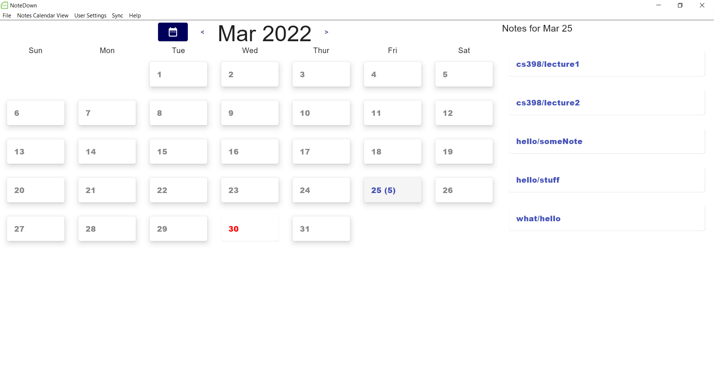

# CS398

This repo contains the application and backend for a markdown note taking app. The app
targets Software developing students. Besides from creating folders and notes edit, the key featrues of
the app are as follows:
* calendar view and open file from calendar
* insert image and display in markdown
* markdown display and text customization (bold, italic, underline, strike through)
* Different Code block syntax highlighting in markdown
* Multi-theme support
* Data stored both locally and remotely, and kept in sync. Will work offline.
* Multi-platform support, Windows and MacOS

### Releases

- [Sprint 3](https://git.uwaterloo.ca/jf2peng/cs398/-/releases/sprint-3)
- [Sprint 2](https://git.uwaterloo.ca/jf2peng/cs398/-/releases/sprint-2)
- [Sprint 1](https://git.uwaterloo.ca/jf2peng/cs398/-/releases/sprint-1)

### Team members

CS398 group, members: Ryan Larkin, Jing Fei Peng, Aarsh Patel

### Meeting minutes
Please visit the following link to view all meeting minutes:
https://coda.io/d/CS398_dmnaoF3a4T2

### Wiki

Link to the landing page of [Wiki](https://git.uwaterloo.ca/jf2peng/cs398/-/wikis/home)

### Application Showcase

Editor screen

Calendar screen where user can click open notes based on the date the note was created

