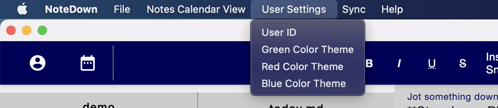

# NoteDown

This repo contains the application and backend for a markdown note-taking app. The app targets Software development students. Besides from creating folders and notes to edit, the key features of the app are as follows:

* Calendar view and open file from calendar
* Insert image and display in markdown
* Markdown display and text customization (bold, italic, underline, strikethrough)
* Different Code block syntax highlighting in markdown
* Multi-theme support
* Data stored both locally and remotely and kept in sync. Will work offline.
* Multi-platform support, Windows and macOS

Team: Ryan Larkin, Jing Fei Peng, Aarsh Patel (Team 109)

### Releases

- [Sprint 3](https://git.uwaterloo.ca/jf2peng/cs398/-/releases/sprint-3) (see also [CHANGELOG.md](CHANGELOG.md))
- [Sprint 2](https://git.uwaterloo.ca/jf2peng/cs398/-/releases/sprint-2)
- [Sprint 1](https://git.uwaterloo.ca/jf2peng/cs398/-/releases/sprint-1)

### Link to other Wiki pages
* [Requirements page](https://git.uwaterloo.ca/jf2peng/cs398/-/wikis/Requirements)
* [Architecture & Design](https://git.uwaterloo.ca/jf2peng/cs398/-/wikis/Analysis-&-Design)
* [Implementation](https://git.uwaterloo.ca/jf2peng/cs398/-/wikis/Implementation)
* [Testing](https://git.uwaterloo.ca/jf2peng/cs398/-/wikis/Testing)

### Releases

- [Sprint 3](https://git.uwaterloo.ca/jf2peng/cs398/-/releases/sprint-3) (see also [CHANGELOG.md](https://git.uwaterloo.ca/jf2peng/cs398/-/blob/master/CHANGELOG.md))
- [Sprint 2](https://git.uwaterloo.ca/jf2peng/cs398/-/releases/sprint-2)
- [Sprint 1](https://git.uwaterloo.ca/jf2peng/cs398/-/releases/sprint-1)

### Meeting minutes
Please visit the following link to view all meeting minutes:
https://coda.io/d/CS398_dmnaoF3a4T2

### Application Showcase

Editor screen

Calendar screen where user can click open notes based on the date the note was created

### Acknowledgement of third party libraries

We used Jetpack Compose as our frontend framework, and Mikepenz's multi-platform markdown renderer to render the markdown. For the backend, we used Spring boot, JDBC, and an SQLite database. For the UI components, we used the standard material UI library for Jetpack Compose.

### Application Usage

By default, we create a NoteTaker folder in the user's directory to save the user's notes. See the "userInstructionGuide.mp4" for a full user instruction guide. The key features are explained below:

#### Color theme

To change themes go to `User Settings` dropdown (on the top left) and select between three themes green, red, and blue.

#### Sync

After the backend is running, the user can use the "upload files to cloud" and "download files to local" buttons to sync the local files to the cloud or download the files the user has already synced on the cloud

#### Useful keyboard shortcuts

Windows/Mac:

- Bold: Ctrl + B / CMD + B
- Italic: Ctrl + I / CMD + I
- Underline: Ctrl + U / CMD + U
- Strikethrough: Ctrl + S / CMD + S
- Code block: Ctrl + W / CMD + W